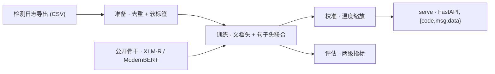

# AI Detector Skill

<p align="center">
  
</p>

<p align="center">
  <a href="https://github.com/lynote-ai/ai-detector-skill/actions/workflows/ci.yml"></a>
  
  
  
</p>

<p align="center">
  一个可解释、偏保守的 AI 文本风险分析器，适合 coding agents 和本地化工作流。
</p>

<p align="center">
  <a href="./README.md">English</a>
  ·
  <a href="#快速开始">快速开始</a>
  ·
  <a href="#数据集评测">数据集评测</a>
  ·
  <a href="#典型使用场景">典型使用场景</a>
</p>

这个项目刻意保持克制。它输出的是 **AI 风格信号风险**，不是作者身份的证据。

> **本仓库有两档。** 本页介绍的是**轻量本地分析器**——一个可解释、无网络的 CLI/Skill，用于快速初筛。**生产级的两级模型**（训练得到、多语言、可 serve）在 [`detection-model-pipeline/`](detection-model-pipeline/)；见 [生产模型工作原理](#生产模型工作原理)。

## 为什么要做这个项目

很多 AI 文本检测器的问题很一致：过度自信、不透明，或者很难塞进代理工作流里。

`ai-detector-skill` 反过来做：

- 用可解释的加权信号，而不是隐藏模型结论
- 提供容易脚本化的本地 CLI 和 Python API
- 对短文本设置保护机制，避免弱证据被说得太满
- 采用适合 Codex、Claude Code 等代理的 Skill 打包方式
- 提供可复现的基准和数据集评测脚本

如果你想要的是一个 **初筛工具**，而不是一个“替你裁决”的系统，这个仓库就是为这个目标设计的。

## 生产模型工作原理

Lynote 背后的重量级检测器是一个**两级模型**：单次前向同时给出文档级（`human / ai / mixed`）和每个句子级（`human / ai / paraphrased`）的判断。它是**训练得到的，不是规则**——完整流程（数据准备 → 训练 → 校准 → 评估 → serve）在 [`detection-model-pipeline/`](detection-model-pipeline/)。



- **一个模型，两个层级。** 文档头与句子头共享骨干；`L = L_doc + α·L_sent`。可微的句子概率统计量喂给文档头——这正是让 `mixed` 类可训练的关键。
- **多语言骨干。** XLM-R-large（默认）或 ModernBERT-base，面向 en / zh / pt / es 优化。
- **经过校准、不过度自信。** 温度缩放只软化概率、不改变预测；置信带 reject < 0.33 ≤ low < 0.6 ≤ medium < 0.8 ≤ high。
- **确定性、有边界。** 哈希固定的切分、合成 demo 数据、`make check` 门禁（manifest / demo / docs / tests）。不发权重、数据集或服务日志，也不做准确率声明。

完整方法：[`MODEL.zh-CN.md`](detection-model-pipeline/docs/MODEL.zh-CN.md) · [`ARCHITECTURE.zh-CN.md`](detection-model-pipeline/docs/ARCHITECTURE.zh-CN.md) · [`DATA_CONSTRUCTION.zh-CN.md`](detection-model-pipeline/docs/DATA_CONSTRUCTION.zh-CN.md) · [`API.zh-CN.md`](detection-model-pipeline/docs/API.zh-CN.md)

## 快速开始

```bash
pip install -e .
ai-detect examples/sample_ai_like.txt --json
```

或者使用初始化脚本：

```bash
bash scripts/setup.sh
```

示例输出：

```text
Conclusion: AI-like signals are present, but this medium-confidence score is a risk estimate rather than proof.
Score: 84/100
Confidence: medium
Verdict: high_ai_likelihood
Words analyzed: 256
```

## 你会得到什么

- `score`：0 到 100 的 AI 风格风险分数
- `verdict`：`insufficient_text`、`low_ai_likelihood`、`mixed_or_uncertain`、`high_ai_likelihood`
- `confidence`：当前为 `low` 或 `medium`
- `signals`：最强的加权证据信号
- `caveats`：必须附带阅读的警示说明
- `next_steps`：必要时给出的后续建议

这个项目希望代理更自然地说出：

- “存在 AI 风格信号。”
- “样本太短，暂时无法给出有意义的估计。”
- “建议与已知写作样本对比后再人工复核。”

而不是：

- “这肯定是 AI 写的。”
- “检测器证明了存在违规。”

## 快速上手

### CLI

```bash
ai-detect examples/sample_ai_like.txt
cat essay.txt | ai-detect --json
python scripts/detect.py examples/sample_human_like.txt --json
```

### Python API

```python
from aidetect import analyze_text

text = open("essay.txt", encoding="utf-8").read()
result = analyze_text(text)

print(result.score, result.confidence, result.verdict)
for signal in result.strongest_signals():
    print(signal.name, signal.note)
```

### 作为本地 Skill 安装

```bash
cp -R ai-detector-skill "$CODEX_HOME/skills/"
```

对于 Codex 或其他可读取仓库说明的代理，建议把根目录的 [SKILL.md](./SKILL.md) 作为主 Skill 定义，并保留根目录的 [AGENTS.md](./AGENTS.md)。

## 数据集评测

我们基于公开的 [HC3 数据集](https://huggingface.co/datasets/Hello-SimpleAI/HC3) 做了一轮可复现测试，使用英文 `finance`、`medicine`、`open_qa` 三个子集，每个子集取前 100 条问答对。

**轻量本地分析器**在这组样本上的摘要表现（非生产两级模型）：

- Human mean score: `5.4`
- AI mean score: `18.4`
- Mean separation: `13.0` points
- Human coverage: `0.427`
- AI coverage: `0.920`
- Covered accuracy at `score >= 45`: `0.317`

这组数据更适合这样解读：

- 这个检测器在均值上能区分人类与 AI 文本，但分离度仍然偏弱
- 短文本保护机制确实在工作，尤其避免了很多较短人类答案被硬判
- 当前阈值明显偏保守，降低了误导性自信，但也压低了召回
- 所以它更适合作为 **初筛 + 解释工具**，而不是独立分类器

完整报告见 [docs/HC3_EVALUATION.md](./docs/HC3_EVALUATION.md)。

复现命令：

```bash
make eval-hc3
```

## 典型使用场景

### 教师初筛

老师收到一篇 400 词左右、语言异常工整的课程反思，希望在人工复核前先看一轮谨慎信号。

建议流程：

1. 运行 `ai-detect submission.txt --json`。
2. 查看最强信号和注意事项。
3. 和学生已知写作样本对比后，再决定是否继续跟进。

### 编辑审核

编辑想先筛掉明显模板化的产品评论或投稿文章，再决定是否投入人工修改时间。

为什么适合：

- 中等篇幅散文文本比极短片段更适合当前检测器
- 可解释信号有助于说明“为什么这段文字看起来像模板化输出”

### 内容安全队列分流

内容审核团队希望把可疑长文本分流到人工复核队列，而不是直接自动删除。

为什么适合：

- 这个工具天然偏保守
- 更适合优先级排序，而不是直接执法或处罚

### 内部内容质检

团队对比人工草稿和 AI 辅助草稿，想观察哪些段落开始显得过于泛化、过于工整。

为什么适合：

- 分数更适合做版本间的相对信号
- 最强信号可以反过来指导改写

## 不建议使用的场景

- 对具名学生或员工直接做纪律处分
- 把单次分数当作作弊或造假的证据
- 对低于约 80 词的短文本强行下结论
- 在没有已知样本对比的情况下处理高风险作者归属争议

## 项目结构

```text
detection-model-pipeline/   # 生产两级模型 — 准备 → 训练 → 校准 → 评估 → serve
├── code/                    # 流程阶段 (i..m) + harness 校验器
├── model_entity/            # 联合模型：ModernBERT + XLM-R 骨干
├── data/demos/              # 合成 demo 数据（哈希固定）
└── docs/                    # ARCHITECTURE / MODEL / DATA_CONSTRUCTION / API

ai-detector-skill/           # 轻量本地分析器（本页）
├── SKILL.md
├── scripts/
│   ├── detect.py
│   ├── setup.sh
│   ├── benchmark.py
│   └── evaluate_hc3.py
├── references/
│   └── api-reference.md
├── assets/
│   ├── hero.svg
│   ├── score-bands.svg
│   ├── workflow.svg
│   └── templates/
│       └── report.md
├── src/aidetect/
├── tests/
├── AGENTS.md
└── README.md
```

## 开发命令

```bash
make test
make demo
make benchmark
make eval-hc3
```

## 持续集成

GitHub Actions 会自动运行：

- 在 Python `3.9`、`3.11`、`3.13` 上执行 `make test`
- 执行 `make benchmark` 重新生成合成基准报告
- 执行 `make eval-hc3` 重新生成 HC3 数据集评测报告
- 将 `docs/BENCHMARK.md` 和 `docs/HC3_EVALUATION.md` 作为 workflow artifact 上传

## 贡献

详见 [CONTRIBUTING.md](./CONTRIBUTING.md)。

通常最有价值的贡献包括：

- 更清晰的证据信号
- 更安全的文案和交互体验
- 仍然保持可解释性的多语言能力
- 更可复现的数据集评测覆盖
- 更顺手的 agent 集成体验

## 许可证

MIT
