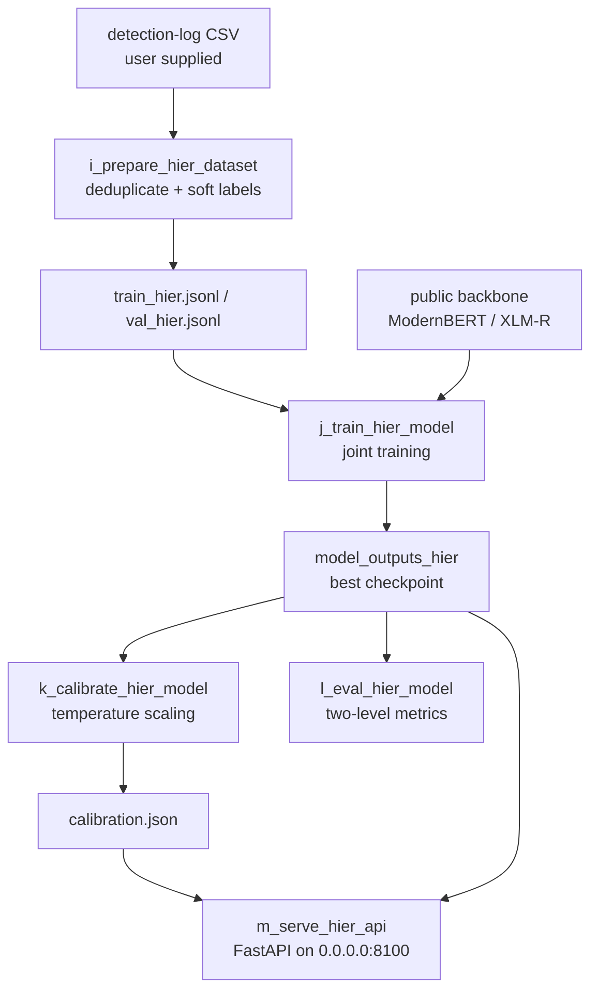

# AI Detect V2: Two-Level AI Text Detection

[Chinese](README.zh-CN.md)

AI Detect V2 trains one joint model that emits document-level `human / ai / mixed`
and sentence-level `human / ai / paraphrased` results in a single forward pass,
optimized with `L = L_doc + α·L_sent`. The repository publishes the full pipeline
code (data preparation, training, calibration, evaluation, HTTP serving), the
model definitions for two backbones, the test suite, and a small set of synthetic
demo data. It intentionally does **not** publish training data, model weights, or
detection-service logs — see [Scope](#scope-and-limitations).

The two-level labels are distilled from a detection-service log export that you
supply yourself. The data format and the pipeline are described in
[docs/DATA_CONSTRUCTION.md](docs/DATA_CONSTRUCTION.md); the model and pipeline
contracts are described in [docs/ARCHITECTURE.md](docs/ARCHITECTURE.md); the
model itself is documented in isolation in [docs/MODEL.md](docs/MODEL.md); the
HTTP interface is specified in [docs/API.md](docs/API.md).

## Pipeline



The important invariants are:

- One forward pass produces both levels; document and sentence heads share the backbone.
- The dataset carries a deterministic train/validation split driven by `scan_id` hashes, so reruns are reproducible.
- Calibration is a separate stage that only softens probabilities; it never changes the argmax.
- The service wraps every response in a `{code, msg, data}` envelope, with a compatibility batch endpoint.
- `make check` gates the repository: manifest, demo data, docs, and the light test subset must all pass without GPU or model weights.

## Repository layout

```text
code/                 pipeline scripts (i_ .. m_) and the harness validators
code/harness/         read-only validators used by `make check`
model_entity/         joint model definitions for the ModernBERT and XLM-R backbones
tests/                pytest suite; the light subset runs without torch
data/demos/           synthetic demo data, hash-pinned by data/demos/manifest.yaml
docs/                 bilingual ARCHITECTURE / MODEL / DATA_CONSTRUCTION / API documents
tools/                maintainer-only demo manifest regenerator
manifest.yaml         reproducibility record: stages, inputs, parameters, artifacts
Makefile              all workflow entry points; `make help` lists them
```

## Quick start

Python 3.12 is recommended. The light validation path only needs `PyYAML`,
`prettytable`, and `tqdm`; the model pipeline additionally needs `torch`,
`transformers>=5`, and the FastAPI stack.

```bash
conda create -n test python=3.12
conda run -n test pip install -r requirements-test.txt
make check
```

Outside the named conda environment, override the interpreter:

```bash
make check PYTHON=python
```

`make check` runs four validations: the manifest schema, the demo data gate
(synthetic-only records, pinned counts, SHA-256 digests, split-rule consistency),
the bilingual documentation gate (relative links, Mermaid blocks, no Chinese text
in English documents), and the light test subset (sentence splitter, dataset
preparation, harness validators). No model inference or training is needed.

The full 51-test suite requires the model dependencies and runs with
`make test-all` after `pip install -r requirements-model.txt -r requirements-test.txt`.

## Public demo data

Five files across three stages are published under `data/demos/`. Every record
is synthetic, authored for this repository, and carries the provenance key
`"source": "synthetic"` — the `make demo-validate` gate rejects anything else.

| Stage | File | Records |
|---|---:|
| 01_prepare | train_hier_demo.jsonl | 20 |
| 01_prepare | val_hier_demo.jsonl | 5 |
| 02_calibrate | calibration_demo.json | 1 |
| 03_serve | detect_response_demo.json | 1 |

Record counts, selection policy, and SHA-256 digests are pinned in
[data/demos/manifest.yaml](data/demos/manifest.yaml) and re-checked by
`make demo-validate`. See [data/README.md](data/README.md) for the schemas.

## Reproducing the pipeline

You supply a detection-service log export in CSV form (the intake contract is
documented in [docs/DATA_CONSTRUCTION.md](docs/DATA_CONSTRUCTION.md)); the
repository never contains one.

```bash
# 1. Prepare the two-level soft-label dataset
make data DATA_CSV=/path/to/detection_log_export.csv

# 2. Train (GPU recommended; xlmr cold-starts from the public HF checkpoint)
make train
#   overrides: make train MODEL_TYPE=modernbert INIT_FROM=/path/to/checkpoint

# 3. Calibrate the document head on the validation split
make calibrate

# 4. Evaluate two-level metrics and upstream-label agreement
make eval

# 5. Serve (0.0.0.0:8100 by default)
make serve
```

Prior exports and prior datasets can be passed to stage 1 for cross-run
deduplication:

```bash
make data DATA_CSV=/path/to/new_export.csv \
  OLD_CSVS="/path/to/older_export.csv" \
  OLD_SCAN_JSONLS="/path/to/old_dataset.jsonl"
```

`make check` never needs a GPU, network access, or model weights. Training
downloads the backbone checkpoint from the Hugging Face hub on first use
(`FacebookAI/xlm-roberta-large` for `xlmr`, `answerdotai/ModernBERT-base` for
`modernbert`); pass `--init-from` / `INIT_FROM` to use a local snapshot instead.

## Design notes

- **Document head** `[sentence-pool 2H ‖ full-text 512-token H ‖ sentence-probability cascade stats 6]` — the cascade statistics are differentiable, so the `mixed` signal flows back into the sentence heads.
- **Loss** `L = L_doc + α·L_sent` with default class weights `1,1,2` against minority-class collapse.
- **Confidence bands** `reject < 0.33 ≤ low < 0.6 ≤ medium < 0.8 ≤ high`, matching the upstream log's confidence categories.
- **Calibration** is a one-parameter temperature fit (LBFGS on soft-label NLL); it changes probabilities, never predictions.
- **Serving** uses bf16 on CUDA and a 50 ms dynamic batcher so concurrent requests share one forward pass.

## Scope and limitations

- Detection scores are **advisory signals for triage, not proof of authorship**. Low-confidence results must be reviewed by a human before any consequential use.
- The model is optimized for `en / zh / pt / es`; other languages run but are unvalidated.
- Input is plain text only; documents are truncated at 256 sentences and 512 tokens for the full-text channel.
- No weights, datasets, or detection-service logs are distributed; you bring your own data and checkpoints.
- The service has no built-in authentication or rate limiting — run it inside a trusted network, not on the public internet.
- No accuracy or benchmark claims are made for this code; the labels it distills come from an external service's log, and this project does not vouch for that service's judgments.

## License

Code is MIT licensed — see [LICENSE](LICENSE). The demo data under
`data/demos/` is synthetic and may be reused freely with attribution; it is
still subject to a human review before any redistribution under your own name.
