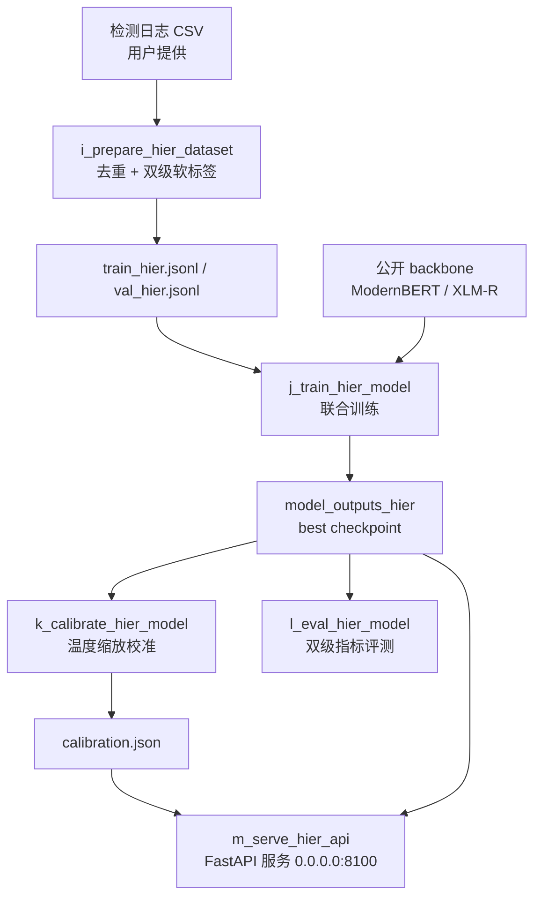

# AI Detect V2：双级 AI 文本检测

[英文版](README.md)

AI Detect V2 训练单个联合模型，一次前向同时产出文档级 `human / ai / mixed`
与句子级 `human / ai / paraphrased` 双级结果，损失为 `L = L_doc + α·L_sent`。
本仓库公开完整流水线代码（数据准备、训练、校准、评测、HTTP 服务）、两种
backbone 的模型定义、测试套件，以及一小批合成 demo 数据。**不**公开训练数据、
模型权重与检测服务日志——见[项目边界](#项目边界)。

双级标签从你自行提供的检测服务日志导出中蒸馏得到。数据格式与流水线见
[docs/DATA_CONSTRUCTION.zh-CN.md](docs/DATA_CONSTRUCTION.zh-CN.md)，模型与
阶段契约见 [docs/ARCHITECTURE.zh-CN.md](docs/ARCHITECTURE.zh-CN.md)，模型
本身的独立文档见 [docs/MODEL.zh-CN.md](docs/MODEL.zh-CN.md)，HTTP 接口规范
见 [docs/API.zh-CN.md](docs/API.zh-CN.md)。

## 流水线



关键不变式：

- 一次前向同时产出两级结果；文档头与句子头共享 backbone。
- 数据集按 `scan_id` 哈希做确定性 train/val 划分，重跑可复现。
- 校准是独立阶段，只软化概率（不改变 argmax 判定）。
- 服务所有响应统一 `{code, msg, data}` 包装，并提供批量兼容端点。
- `make check` 是仓库门禁：manifest、demo 数据、文档与轻量测试子集全部通过，且无需 GPU 或模型权重。

## 目录结构

```text
code/                 流水线脚本（i_ .. m_）与 harness 校验器
code/harness/         make check 使用的只读校验器
model_entity/         ModernBERT 与 XLM-R 两种 backbone 的联合模型定义
tests/                pytest 套件；轻量子集无需 torch
data/demos/           合成 demo 数据，哈希锁定于 data/demos/manifest.yaml
docs/                 双语的 ARCHITECTURE / MODEL / DATA_CONSTRUCTION / API 文档
tools/                维护者使用的 demo 登记文件重建工具
manifest.yaml         可复现记录：阶段、输入、参数、产物
Makefile              全部工作流入口；make help 列出
```

## 快速开始

推荐 Python 3.12。轻量校验路径只需要 `PyYAML`、`prettytable`、`tqdm`；模型
流水线额外需要 `torch`、`transformers>=5` 与 FastAPI 技术栈。

```bash
conda create -n test python=3.12
conda run -n test pip install -r requirements-test.txt
make check
```

在命名 conda 环境之外，覆盖解释器即可：

```bash
make check PYTHON=python
```

`make check` 依次执行四项校验：manifest schema、demo 数据门禁（仅合成记录、
条数与 SHA-256 锁定、划分规则一致）、双语文档门禁（相对链接、Mermaid 图、
英文文档无中文混入）与轻量测试子集（分句器、数据准备、harness 校验器）。
整个过程无需模型推理或训练。

完整 51 个测试需要模型依赖：先 `pip install -r requirements-model.txt
-r requirements-test.txt`，再 `make test-all`。

## 公开 demo 数据

`data/demos/` 下发布三个阶段的 5 个文件。每条记录均为合成数据，专为本仓库
撰写，并带有溯源键 `"source": "synthetic"`——`make demo-validate` 门禁会拒绝
任何其他来源。

| 阶段 | 文件 | 记录数 |
|---|---:|---:|
| 01_prepare | train_hier_demo.jsonl | 20 |
| 01_prepare | val_hier_demo.jsonl | 5 |
| 02_calibrate | calibration_demo.json | 1 |
| 03_serve | detect_response_demo.json | 1 |

记录数、选取策略与 SHA-256 摘要锁定在
[data/demos/manifest.yaml](data/demos/manifest.yaml)，并由
`make demo-validate` 复核。Schema 见 [data/README.zh-CN.md](data/README.zh-CN.md)。

## 复现流水线

你需要自行提供 CSV 形式的检测服务日志导出（入口契约见
[docs/DATA_CONSTRUCTION.zh-CN.md](docs/DATA_CONSTRUCTION.zh-CN.md)）；本仓库
永不包含此类数据。

```bash
# 1. 准备双级软标签数据集
make data DATA_CSV=/path/to/detection_log_export.csv

# 2. 联合训练（建议 GPU；xlmr 默认从公开 HF checkpoint 冷启动）
make train
#   覆盖：make train MODEL_TYPE=modernbert INIT_FROM=/path/to/checkpoint

# 3. 在验证集上校准文档头温度
make calibrate

# 4. 评测双级指标与上游标签一致率
make eval

# 5. 起服务（默认 0.0.0.0:8100）
make serve
```

重复运行时可将上一批导出与旧数据集传给第 1 步做跨批去重：

```bash
make data DATA_CSV=/path/to/new_export.csv \
  OLD_CSVS="/path/to/older_export.csv" \
  OLD_SCAN_JSONLS="/path/to/old_dataset.jsonl"
```

`make check` 永不需要 GPU、网络或模型权重。训练首次运行会从 Hugging Face hub
下载 backbone checkpoint（`xlmr` 为 `FacebookAI/xlm-roberta-large`，
`modernbert` 为 `answerdotai/ModernBERT-base`）；传 `--init-from` / `INIT_FROM`
可改用本地快照。

## 设计要点

- **文档头** `[句向量池化 2H ‖ 全文 512-token 编码 H ‖ 句级概率级联统计 6]`——级联统计可微，`mixed` 信号可回传句级头。
- **损失** `L = L_doc + α·L_sent`，默认类权重 `1,1,2` 对抗少数类坍塌。
- **置信分档** `reject < 0.33 ≤ low < 0.6 ≤ medium < 0.8 ≤ high`，与上游日志的 confidenceCategory 口径一致。
- **校准**为单参数温度拟合（LBFGS 最小化软标签 NLL）；只改变概率，不改变判定。
- **服务**在 CUDA 上使用 bf16 与 50ms 动态攒批，并发请求共享一次前向。

## 项目边界

- 检测分数是**辅助分诊信号，不是作者身份证明**。低置信度结果必须经人工复核后才能用于任何重要决策。
- 模型面向 `en / zh / pt / es` 四语优化；其他语言可运行但未经专门验证。
- 仅支持纯文本输入；单篇截断上限 256 句，全文通道编码上限 512 token。
- 不分发任何权重、数据集或检测服务日志；数据与 checkpoint 由使用者自行准备。
- 服务内置无认证、无配额——请部署在可信内网，不要直接暴露公网。
- 本项目不对代码效果作任何准确率宣称；蒸馏所用标签来自外部服务的日志，本项目不对该服务的判断背书。

## 许可证

代码采用 MIT 许可证——见 [LICENSE](LICENSE)。`data/demos/` 下的 demo 数据为
合成数据，可自由使用并署名；以你自己名义再分发前，仍需人工复核。
