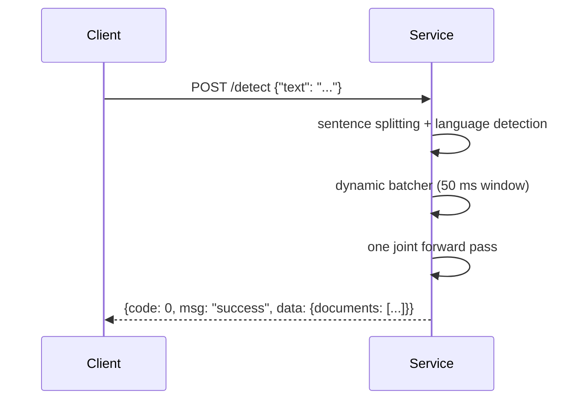

# HTTP API

[Chinese](API.zh-CN.md)

- Service: two-level (document + sentence) AI text detection
- Default address: `http://<host>:8100` (host `0.0.0.0`, configurable via
  `AI_DETECT_HOST` / `AI_DETECT_PORT` or `make serve HOST= PORT=`)
- Content type: `application/json` for both request and response
- Version: `V2-hier-1`



## 1. Unified response envelope

Every endpoint, including the probe and errors, returns the same wrapper:

| Field | Type | Always | Definition |
|---|---|---|---|
| code | int | yes | Business code. `0` success; non-zero failure, see section 6 |
| msg | string | yes | `"success"` on success; human-readable reason on failure |
| data | object \| null | yes | Business payload on success (section 5); always `null` on failure |

```json
// success (probe payload; the detect payload is shown in 4.3)
{"code": 0, "msg": "success", "data": {"status": "ok", "model_loaded": true}}

// failure
{"code": 1003, "msg": "batch size 33 exceeds limit 32", "data": null}
```

## 2. Endpoint overview

| Method | Path | Description |
|---|---|---|
| GET | `/` | Service probe |
| POST | `/detect` | Detection: `text` accepts a string or a string array (array = batch, <= 32 documents) |
| POST | `/detect/batch` | Batch compatibility endpoint (equivalent to array input on `/detect`) |

## 3. GET / — service probe

**Response fields (data part)**

| Field | Type | Always | Definition |
|---|---|---|---|
| status | string | yes | Always `"ok"` while the process is alive |
| model_loaded | bool | yes | Whether the model finished loading; detection returns 1004 while `false` |

```json
{"code": 0, "msg": "success", "data": {"status": "ok", "model_loaded": true}}
```

## 4. POST /detect and POST /detect/batch

### 4.1 /detect request fields

| Field | Type | Required | Definition |
|---|---|---|---|
| text | string \| string[] | yes | One document as a string; a batch as an array (1-32 documents, each non-empty). Array input is inferred in one pass and `documents` matches the array order |

```bash
# single document
curl -X POST localhost:8100/detect \
  -H 'Content-Type: application/json' \
  -d '{"text": "Artificial intelligence is transforming education. Teachers must adapt their methods."}'

# batch (same endpoint, array input)
curl -X POST localhost:8100/detect \
  -H 'Content-Type: application/json' \
  -d '{"text": ["First document text.", "Second document text."]}'
```

### 4.2 /detect/batch request fields (compatibility endpoint)

Fully equivalent to array input on `/detect`, kept for early integrators:

| Field | Type | Required | Definition |
|---|---|---|---|
| texts | string[] | yes | Texts to detect; 1-32 elements (over the limit: 1003), each non-blank (blank item: 1002) |

```bash
curl -X POST localhost:8100/detect/batch \
  -H 'Content-Type: application/json' \
  -d '{"texts": ["First document text.", "Second document text."]}'
```

Batch and single results share one structure: `data.documents` has one entry
per input, in order; inference is batched, so total time is close to the sum
of individual calls.

### 4.3 Full success response example (code/msg/data wrapper)

```json
{
  "code": 0,
  "msg": "success",
  "data": {
    "version": "V2-hier-1",
    "neatVersion": "V2h",
    "scanId": "e3f1c2a94b7d4e5f8a9b0c1d2e3f4a5b",
    "documents": [
      {
        "paragraphs": [
          {
            "startSentenceIndex": 0,
            "numSentences": 2,
            "completelyGeneratedProb": 0.65
          }
        ],
        "sentences": [
          {
            "generatedProb": 0.95,
            "sentence": "Artificial intelligence is transforming education.",
            "perplexity": 0,
            "classProbabilities": {"human": 0.05, "ai": 0.90, "paraphrased": 0.05},
            "highlightSentenceForAi": true,
            "specialHighlightType": null
          },
          {
            "generatedProb": 0.35,
            "sentence": "Teachers must adapt their methods.",
            "perplexity": 0,
            "classProbabilities": {"human": 0.65, "ai": 0.30, "paraphrased": 0.05},
            "highlightSentenceForAi": false,
            "specialHighlightType": null
          }
        ],
        "classProbabilities": {"human": 0.28, "ai": 0.62, "mixed": 0.10},
        "confidenceThresholdsRaw": {
          "identity": {
            "human": {"reject": 0.33, "low": 0.6, "medium": 0.8},
            "ai": {"reject": 0.33, "low": 0.6, "medium": 0.8},
            "mixed": {"reject": 0.33, "low": 0.6, "medium": 0.8}
          }
        },
        "confidenceScoresRaw": {"identity": {"human": 0.28, "ai": 0.62, "mixed": 0.10}},
        "subclass": {},
        "pageNumber": 0,
        "language": "en",
        "inputText": "Artificial intelligence is transforming education. Teachers must adapt their methods.",
        "documentId": "a1b2c3d4e5f6a7b8c9d0e1f2a3b4c5d6",
        "predictedClass": "ai",
        "confidenceScore": 0.62,
        "confidenceCategory": "medium",
        "documentClassification": "AI_ONLY",
        "resultMessage": "Moderate confidence that the text was written by AI.",
        "completelyGeneratedProb": 0.62,
        "averageGeneratedProb": 0.65,
        "overallBurstiness": 0,
        "writingStats": {},
        "version": "V2-hier-1",
        "neatVersion": "V2h"
      }
    ]
  }
}
```

## 5. data field definitions

### 5.1 Top level (data)

| Field | Type | Always | Definition |
|---|---|---|---|
| version | string | yes | Service version, currently always `"V2-hier-1"` |
| neatVersion | string | yes | Short version, currently always `"V2h"` |
| scanId | string | yes | Unique id for this request (32 hex chars), regenerated per call |
| documents | array[object] | yes | Detection results; `/detect` always has 1 element; `/detect/batch` matches the request count, see 5.2 |

### 5.2 documents[] — document-level results

| Field | Type | Always | Definition |
|---|---|---|---|
| documentId | string | yes | Unique id of this document (32 hex chars) |
| inputText | string | yes | The original input text, echoed back |
| language | string | yes | ISO 639-1 language code (e.g. `en`/`zh`/`es`/`pt`) detected by langdetect, falling back to `en` |
| predictedClass | string | yes | Document judgment: `human` / `ai` / `mixed`, the argmax of `classProbabilities` |
| classProbabilities | object | yes | Document probabilities over `human`/`ai`/`mixed` (floats summing to 1; temperature-calibrated) |
| confidenceScore | float | yes | Confidence score = max(classProbabilities), range [0,1] |
| confidenceCategory | string | yes | Confidence band: `high` (>=0.8) / `medium` (>=0.6) / `low` (>=0.33) / `reject` (<0.33); `low` and `reject` share one resultMessage |
| documentClassification | string | yes | Uppercase enum of predictedClass: `HUMAN_ONLY` / `AI_ONLY` / `MIXED` |
| completelyGeneratedProb | float | yes | "Completely AI-generated" probability = P(ai), range [0,1] |
| averageGeneratedProb | float | yes | Arithmetic mean of all sentence `generatedProb` values, range [0,1] |
| overallBurstiness | int | yes | Reserved field, always `0` |
| writingStats | object | yes | Reserved field, always `{}` |
| resultMessage | string | yes | Human-readable conclusion from the (predictedClass, confidenceCategory) template; truncated inputs append `"(Input truncated to 256 sentences.)"` |
| paragraphs | array[object] | yes | Paragraph results, see 5.3; paragraphs split on blank lines |
| sentences | array[object] | yes | Sentence results, see 5.4; multilingual splitting, max 256 sentences per document |
| confidenceThresholdsRaw | object | yes | This service's confidence band table: `identity.<class>.{reject:0.33, low:0.6, medium:0.8}`, identical across classes |
| confidenceScoresRaw | object | yes | Same structure as above; `identity` holds the classProbabilities values |
| subclass | object | yes | Reserved field, always `{}` |
| pageNumber | int | yes | Reserved field, always `0` |
| version / neatVersion | string | yes | Same as 5.1, repeated at document level for compatibility |

### 5.3 paragraphs[] — paragraph-level results

| Field | Type | Always | Definition |
|---|---|---|---|
| startSentenceIndex | int | yes | Global index of the paragraph's first sentence in `sentences` (0-based) |
| numSentences | int | yes | Number of sentences in this paragraph |
| completelyGeneratedProb | float | yes | "Completely AI-generated" probability for the paragraph = mean of its sentences' `generatedProb` (paragraphs have no own classifier head), range [0,1] |

### 5.4 sentences[] — sentence-level results

| Field | Type | Always | Definition |
|---|---|---|---|
| sentence | string | yes | Sentence text (with trailing punctuation) |
| classProbabilities | object | yes | Sentence probabilities over `human` / `ai` / `paraphrased` (floats summing to 1) |
| generatedProb | float | yes | "AI involvement" probability for this sentence = P(ai) + P(paraphrased), range [0,1] |
| highlightSentenceForAi | bool | yes | Frontend highlight flag; `true` when `generatedProb >= 0.5` |
| specialHighlightType | string \| null | yes | Sentence subtype: `"polished"` when `paraphrased` is the sentence argmax, otherwise `null` |
| perplexity | int | yes | Reserved field, always `0` |

## 6. Error codes

HTTP status codes are preserved verbatim (for gateways and retry logic); each
maps to one business code:

| HTTP | code | Trigger | Example msg |
|---|---|---|---|
| 200 | 0 | Success | `"success"` |
| 422 | 1001 | Request validation failed: `text` missing/empty; `texts` missing/empty array | `"request validation failed: [...]"` |
| 400 | 1002 | Text unparseable: no sentence could be split (blank or symbol-only); a batch item is blank | `"text contains no parseable sentence"` |
| 413 | 1003 | Batch over the limit: more than 32 texts | `"batch size 33 exceeds limit 32"` |
| 503 | 1004 | Model not ready (still loading at startup) | `"model not loaded"` |

## 7. Limits and constraints

| Item | Value | Notes |
|---|---|---|
| Batch limit | 32 documents/request | Over the limit returns 1003 |
| Sentence truncation | 256 sentences/document | Beyond it, `resultMessage` appends a notice |
| Sentence encoding | 128 tokens/sentence | Longer sentences are truncated internally |
| Full-text encoding | 512 tokens/document | The document-head channel input cap |

## 8. Integration tips

- **Just the verdict**: read `data.documents[0].predictedClass` + `confidenceCategory` (treat `low`/`reject` as uncertain).
- **Sentence highlighting**: draw AI highlights from `sentences[].highlightSentenceForAi`; draw polish marks where `specialHighlightType == "polished"`.
- **Locating mixed content**: use `paragraphs[].completelyGeneratedProb` for AI paragraphs and `classProbabilities.mixed` for the whole document.
- **Batch testing**: pass an array to `/detect` (<= 32 documents per request; the whole batch is inferred in one pass).
- **Uniform error handling**: check `code != 0` first; `data` is always `null` on failure, no second unwrap needed.
