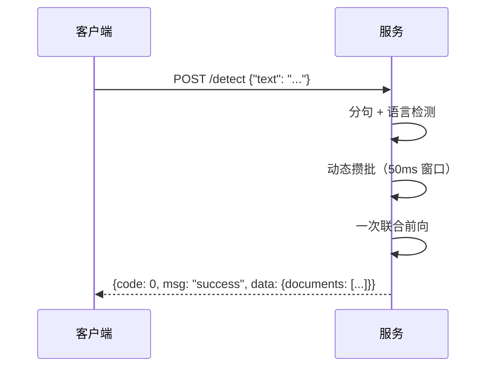

# HTTP 接口文档

[英文版](API.md)

- 服务：双级（文档级 + 句子级）AI 文本检测
- 默认地址：`http://<host>:8100`（host `0.0.0.0`，可用 `AI_DETECT_HOST` /
  `AI_DETECT_PORT` 或 `make serve HOST= PORT=` 配置）
- 内容类型：请求与响应均为 `application/json`
- 版本：`V2-hier-1`



## 1. 统一响应结构

所有接口（含探针与错误）均返回以下包装结构：

| 字段 | 类型 | 必现 | 定义 |
|---|---|---|---|
| code | int | 是 | 业务状态码。`0` 成功；非 `0` 失败，取值见第 6 节错误码表 |
| msg | string | 是 | 状态描述。成功恒为 `"success"`；失败为可读错误原因 |
| data | object \| null | 是 | 成功时为业务数据（第 5 节）；失败时恒为 `null` |

```json
// 成功（探针数据；检测接口完整示例见 4.3）
{"code": 0, "msg": "success", "data": {"status": "ok", "model_loaded": true}}

// 失败
{"code": 1003, "msg": "batch size 33 exceeds limit 32", "data": null}
```

## 2. 接口总览

| 方法 | 路径 | 说明 |
|---|---|---|
| GET | `/` | 服务探针 |
| POST | `/detect` | 检测：`text` 接受单字符串或字符串数组（数组即批量，≤ 32 篇） |
| POST | `/detect/batch` | 批量检测兼容端点（等价于 `/detect` 的数组输入） |

## 3. GET / —— 服务探针

**响应字段定义（data 部分）**

| 字段 | 类型 | 必现 | 定义 |
|---|---|---|---|
| status | string | 是 | 恒为 `"ok"`，表示进程存活 |
| model_loaded | bool | 是 | 模型是否加载完成；`false` 时调用检测接口返回 1004 |

```json
{"code": 0, "msg": "success", "data": {"status": "ok", "model_loaded": true}}
```

## 4. POST /detect 与 POST /detect/batch

### 4.1 /detect 请求字段定义

| 字段 | 类型 | 必填 | 定义 |
|---|---|---|---|
| text | string \| string[] | 是 | 单篇传字符串；批量传字符串数组（1–32 篇，逐项非空）。数组输入整批一次推理，返回 `documents` 与数组顺序一一对应 |

```bash
# 单篇
curl -X POST localhost:8100/detect \
  -H 'Content-Type: application/json' \
  -d '{"text": "Artificial intelligence is transforming education. Teachers must adapt their methods."}'

# 批量（同一接口，直接传数组）
curl -X POST localhost:8100/detect \
  -H 'Content-Type: application/json' \
  -d '{"text": ["First document text.", "Second document text."]}'
```

### 4.2 /detect/batch 请求字段定义（兼容端点）

与 `/detect` 的数组输入完全等价，供早期对接方继续使用：

| 字段 | 类型 | 必填 | 定义 |
|---|---|---|---|
| texts | string[] | 是 | 待检测文本数组；元素数 1–32（超限 1003），逐项非空（空白项 1002） |

```bash
curl -X POST localhost:8100/detect/batch \
  -H 'Content-Type: application/json' \
  -d '{"texts": ["First document text.", "Second document text."]}'
```

批量与单篇结果同构：`data.documents` 长度等于请求数量、顺序一一对应；
同步分批推理，耗时约等于逐篇调用之和。

### 4.3 成功响应完整示例（含 code/msg/data 包装）

```json
{
  "code": 0,
  "msg": "success",
  "data": {
    "version": "V2-hier-1",
    "neatVersion": "V2h",
    "scanId": "e3f1c2a94b7d4e5f8a9b0c1d2e3f4a5b",
    "documents": [
      {
        "paragraphs": [
          {
            "startSentenceIndex": 0,
            "numSentences": 2,
            "completelyGeneratedProb": 0.65
          }
        ],
        "sentences": [
          {
            "generatedProb": 0.95,
            "sentence": "Artificial intelligence is transforming education.",
            "perplexity": 0,
            "classProbabilities": {"human": 0.05, "ai": 0.90, "paraphrased": 0.05},
            "highlightSentenceForAi": true,
            "specialHighlightType": null
          },
          {
            "generatedProb": 0.35,
            "sentence": "Teachers must adapt their methods.",
            "perplexity": 0,
            "classProbabilities": {"human": 0.65, "ai": 0.30, "paraphrased": 0.05},
            "highlightSentenceForAi": false,
            "specialHighlightType": null
          }
        ],
        "classProbabilities": {"human": 0.28, "ai": 0.62, "mixed": 0.10},
        "confidenceThresholdsRaw": {
          "identity": {
            "human": {"reject": 0.33, "low": 0.6, "medium": 0.8},
            "ai": {"reject": 0.33, "low": 0.6, "medium": 0.8},
            "mixed": {"reject": 0.33, "low": 0.6, "medium": 0.8}
          }
        },
        "confidenceScoresRaw": {"identity": {"human": 0.28, "ai": 0.62, "mixed": 0.10}},
        "subclass": {},
        "pageNumber": 0,
        "language": "en",
        "inputText": "Artificial intelligence is transforming education. Teachers must adapt their methods.",
        "documentId": "a1b2c3d4e5f6a7b8c9d0e1f2a3b4c5d6",
        "predictedClass": "ai",
        "confidenceScore": 0.62,
        "confidenceCategory": "medium",
        "documentClassification": "AI_ONLY",
        "resultMessage": "Moderate confidence that the text was written by AI.",
        "completelyGeneratedProb": 0.62,
        "averageGeneratedProb": 0.65,
        "overallBurstiness": 0,
        "writingStats": {},
        "version": "V2-hier-1",
        "neatVersion": "V2h"
      }
    ]
  }
}
```

## 5. data 字段完整定义

### 5.1 顶层（data）

| 字段 | 类型 | 必现 | 定义 |
|---|---|---|---|
| version | string | 是 | 服务版本标识，当前恒为 `"V2-hier-1"` |
| neatVersion | string | 是 | 服务短版本标识，当前恒为 `"V2h"` |
| scanId | string | 是 | 本次请求的唯一 id（32 位 uuid hex），每次调用重新生成 |
| documents | array[object] | 是 | 检测结果数组；`/detect` 恒为 1 个元素；`/detect/batch` 与请求数量一致，见 5.2 |

### 5.2 documents[] —— 文档级结果

| 字段 | 类型 | 必现 | 定义 |
|---|---|---|---|
| documentId | string | 是 | 该篇文档的唯一 id（32 位 uuid hex） |
| inputText | string | 是 | 原始输入文本（原样回传） |
| language | string | 是 | 语言码（ISO 639-1，如 `en`/`zh`/`es`/`pt`），langdetect 检测，异常兜底 `en` |
| predictedClass | string | 是 | 文档级判定：`human`（人写）/ `ai`（AI 生成）/ `mixed`（混合）＝ classProbabilities 的 argmax |
| classProbabilities | object | 是 | 文档级三类概率：`human`/`ai`/`mixed`（float，和为 1；已温度校准） |
| confidenceScore | float | 是 | 置信度分数 ＝ max(classProbabilities)，范围 [0,1] |
| confidenceCategory | string | 是 | 置信分档：`high`（≥0.8）/ `medium`（≥0.6）/ `low`（≥0.33）/ `reject`（<0.33）；`low` 与 `reject` 共用同一句 resultMessage 文案 |
| documentClassification | string | 是 | predictedClass 的大写枚举：`HUMAN_ONLY` / `AI_ONLY` / `MIXED` |
| completelyGeneratedProb | float | 是 | "完全 AI 生成"概率 ＝ P(ai)，范围 [0,1] |
| averageGeneratedProb | float | 是 | 全部句子 `generatedProb` 的算术均值，范围 [0,1] |
| overallBurstiness | int | 是 | 保留字段，恒为 `0` |
| writingStats | object | 是 | 保留字段，恒为 `{}` |
| resultMessage | string | 是 | 人类可读结论文案，由 (predictedClass, confidenceCategory) 查模板生成；句子数被截断时追加 `"(Input truncated to 256 sentences.)"` |
| paragraphs | array[object] | 是 | 段落级结果，见 5.3；按输入文本的空行切分 |
| sentences | array[object] | 是 | 句子级结果，见 5.4；多语言分句，单篇上限 256 句 |
| confidenceThresholdsRaw | object | 是 | 本服务自身置信分档表：`identity.<class>.{reject:0.33, low:0.6, medium:0.8}`，三类结构相同 |
| confidenceScoresRaw | object | 是 | 同结构；`identity` 内与 classProbabilities 同值 |
| subclass | object | 是 | 保留字段，恒为 `{}` |
| pageNumber | int | 是 | 保留字段，恒为 `0` |
| version / neatVersion | string | 是 | 同 5.1，文档级重复字段（兼容旧对接方） |

### 5.3 paragraphs[] —— 段落级结果

| 字段 | 类型 | 必现 | 定义 |
|---|---|---|---|
| startSentenceIndex | int | 是 | 该段首句在 `sentences` 数组中的全局下标（从 0 起） |
| numSentences | int | 是 | 该段包含的句子数 |
| completelyGeneratedProb | float | 是 | 该段的"完全 AI 生成"概率 ＝ 段内句子 `generatedProb` 的均值（段落无独立分类头，用句级概率聚合），范围 [0,1] |

### 5.4 sentences[] —— 句子级结果

| 字段 | 类型 | 必现 | 定义 |
|---|---|---|---|
| sentence | string | 是 | 句子文本（含句末标点） |
| classProbabilities | object | 是 | 句子级三类概率：`human` / `ai` / `paraphrased`（float，和为 1） |
| generatedProb | float | 是 | 该句"AI 参与"概率 ＝ P(ai) + P(paraphrased)，范围 [0,1] |
| highlightSentenceForAi | bool | 是 | 前端高亮标记；`generatedProb ≥ 0.5` 时为 `true` |
| specialHighlightType | string \| null | 是 | 句子子类型标记：`paraphrased` 为该句 argmax 时为 `"polished"`（AI 润色句），否则为 `null` |
| perplexity | int | 是 | 保留字段，恒为 `0` |

## 6. 错误码

HTTP 状态码原样保留（供网关/重试逻辑使用），业务 code 与之一一对应：

| HTTP | code | 触发场景 | msg 示例 |
|---|---|---|---|
| 200 | 0 | 成功 | `"success"` |
| 422 | 1001 | 请求体校验失败：`text` 缺失/为空字符串；`texts` 缺失/为空数组 | `"请求参数校验失败: [...]"` |
| 400 | 1002 | 文本无法解析：单篇切不出任何句子（如纯空白/纯符号）；批量中某项为空白文本 | `"text contains no parseable sentence"` |
| 413 | 1003 | 批量超限：`texts` 元素数 > 32 | `"batch size 33 exceeds limit 32"` |
| 503 | 1004 | 模型未就绪（服务启动加载中） | `"model not loaded"` |

## 7. 约束与限制

| 项 | 值 | 说明 |
|---|---|---|
| 批量上限 | 32 篇/请求 | 超限返回 1003 |
| 句子截断 | 256 句/篇 | 超出截断，`resultMessage` 追加提示 |
| 句子编码长度 | 128 token/句 | 超长句内部截断，不影响输出句数 |
| 全文编码长度 | 512 token/篇 | 文档级通道输入上限 |

## 8. 快速对接建议

- **只要结论**：读 `data.documents[0].predictedClass` + `confidenceCategory`（`low`/`reject` 建议视为不确定）
- **逐句高亮**：`sentences[].highlightSentenceForAi` 画 AI 高亮，`specialHighlightType == "polished"` 画润色标记
- **混合文本定位**：`paragraphs[].completelyGeneratedProb` 定位 AI 段落，`classProbabilities.mixed` 判断整篇是否混合
- **批量回测**：`/detect` 直接传数组（≤32 篇/请求分页调用，整批一次推理）
- **统一判错**：先判 `code != 0`，`data` 恒为 `null`，不需要二次解包

## 9. 部署说明

服务内置无认证、无配额，请部署在可信内网。启动参数通过环境变量
`AI_DETECT_MODEL_TYPE` / `AI_DETECT_MODEL_DIR` / `AI_DETECT_HOST` /
`AI_DETECT_PORT` 覆盖（`make serve` 会按 Make 变量透传），配置示例见仓库根
`.env.example`。
