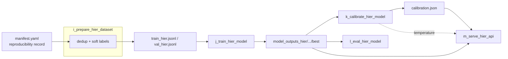
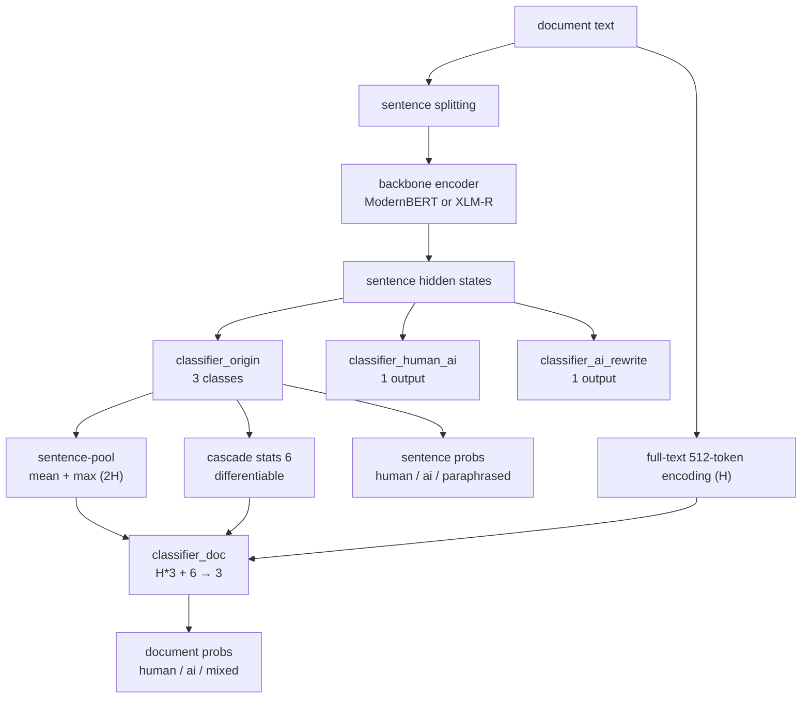
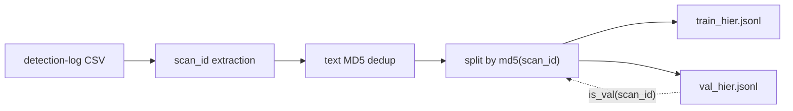

# Architecture

[Chinese](ARCHITECTURE.zh-CN.md)

This document describes the stage contracts and the model architecture of
AI Detect V2. The data side of the pipeline (intake contract, deduplication,
label schema) is covered in [DATA_CONSTRUCTION.md](DATA_CONSTRUCTION.md).

## Stage contracts

Five scripts form the pipeline. The filename prefix encodes the order
(`i_` → `m_`), and each stage has one input contract and one invariant.

| Stage | Module | Input | Output | Primary invariant |
|---|---|---|---|---|
| i. Preparation | `code/i_prepare_hier_dataset.py` | detection-log CSV export (user-supplied) | `data/train_hier.jsonl`, `data/val_hier.jsonl` | three-layer leakage exclusion + deterministic split |
| j. Training | `code/j_train_hier_model.py` | the two JSONL files, backbone checkpoint | `model_outputs_hier/<run>/best` | one forward produces both levels; best checkpoint selected by `hier_macro_f1` |
| k. Calibration | `code/k_calibrate_hier_model.py` | best checkpoint, val JSONL | `<best>/calibration.json` | temperature changes probabilities, never the argmax |
| l. Evaluation | `code/l_eval_hier_model.py` | best checkpoint, val JSONL | printed reports (tables) | two-level metrics + upstream-label agreement, grouped by language |
| m. Serving | `code/m_serve_hier_api.py` | best checkpoint, `calibration.json` | HTTP service on `0.0.0.0:8100` | `{code, msg, data}` envelope; startup refuses mismatched backbones |

## Model architecture

One backbone is shared by the sentence heads and the document head. The model
is documented in full isolation — heads, pooling, losses, feature vector,
output contract, backbone entities, checkpoint contract — in
[MODEL.md](MODEL.md); this section summarizes its place in the pipeline.

The document head input is the concatenation of:

- **sentence-pool 2H** — mean and max pooling over the sentence hidden states,
- **full-text H** — a separate 512-token encoding of the whole document,
- **cascade stats 6** — differentiable aggregates of the sentence probability
  distributions (counts and probability mass per sentence class), which give the
  document head an explicit "how many sentences look AI-written" signal for the
  `mixed` class.

The training loss is `L = L_doc + α·L_sent`: the document head optimizes soft
cross-entropy against the document label distribution, and the sentence heads
optimize a weighted soft cross-entropy (plus masked BCE for the two auxiliary
heads) against the sentence label distributions.

Two backbones are interchangeable behind `--model-type`:

- `modernbert` — English-first, faster, warm-start friendly.
- `xlmr` — the default; `FacebookAI/xlm-roberta-large` cold start, optimized
  for the en/zh/pt/es mix.

The XLM-R entity must keep the attribute name `self.roberta` because official
checkpoint keys are prefixed `roberta.*`; renaming it would silently drop the
entire backbone during `from_pretrained`.

## Design choices

- **One forward, two levels.** Document and sentence heads share the encoder, so serving cost is a single pass per batch.
- **Full-text channel.** The document head sees the whole document through its own 512-token encoding, not only aggregated sentence features.
- **Differentiable cascade statistics.** Feeding sentence-probability aggregates into the document head lets the `mixed` signal supervise the sentence heads directly.
- **Class weights.** `doc_class_weights` / `sent_class_weights` default to `1,1,2` to counter minority-class collapse.
- **Calibration as its own stage.** A one-parameter temperature fit on the validation split improves confidence calibration without touching predictions.
- **Deterministic selection.** Split rule, oversampling, and seeds are fixed so runs are reproducible (see `manifest.yaml`).
- **Early stop with a floor.** Training stops on `eval_hier_macro_f1` after `--patience` checks, but never before `--min-epochs`.
- **50 ms dynamic batching.** Requests arriving within a window share one forward pass; the batcher is the only thread touching the model.
- **Two-layer validation.** The harness validators (read-only, dependency-light) gate the repository, and the tests cover the pipeline logic.

## Data identity

Records are joined by hash identity rather than positional pairing. Each record
keeps `scan_id` (the upstream request id), and deduplication works on normalized
text MD5. `gptzero_doc_class` / `gptzero_language` are field names read verbatim
from the upstream log; they are kept for schema compatibility and described
neutrally as upstream labels in [DATA_CONSTRUCTION.md](DATA_CONSTRUCTION.md).

## What remains external

Model weights, the full dataset, and the detection-service logs stay outside
this repository. The backbone checkpoints are downloaded from the Hugging Face
hub (or supplied as local snapshots), and the training data is built by you
from your own log exports. The HTTP contract is specified in
[API.md](API.md).
