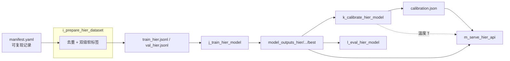
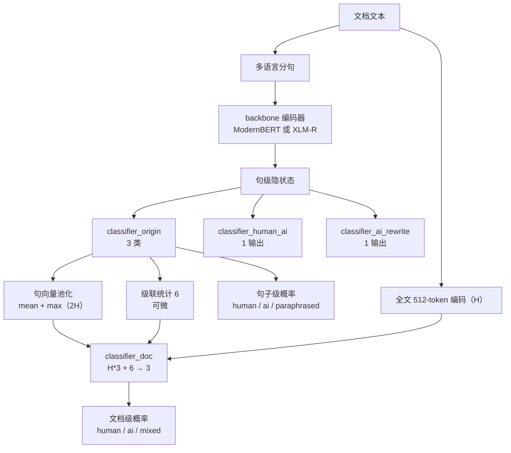
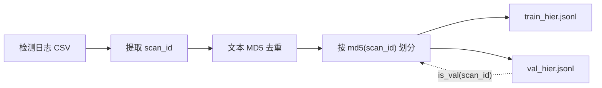

# 架构说明

[英文版](ARCHITECTURE.md)

本文说明 AI Detect V2 的阶段契约与模型结构。数据侧（入口契约、去重、标签
schema）见 [DATA_CONSTRUCTION.zh-CN.md](DATA_CONSTRUCTION.zh-CN.md)。

## 阶段契约

流水线由 5 个脚本组成，文件名前缀即顺序（`i_` → `m_`），每个阶段一个输入
契约、一条核心不变式。

| 阶段 | 模块 | 输入 | 输出 | 核心不变式 |
|---|---|---|---|---|
| i. 数据准备 | `code/i_prepare_hier_dataset.py` | 检测日志 CSV 导出（用户提供） | `data/train_hier.jsonl`、`data/val_hier.jsonl` | 三重泄露排除 + 确定性划分 |
| j. 联合训练 | `code/j_train_hier_model.py` | 两个 JSONL、backbone checkpoint | `model_outputs_hier/<run>/best` | 一次前向双级输出；按 `hier_macro_f1` 选优 |
| k. 温度校准 | `code/k_calibrate_hier_model.py` | best checkpoint、val JSONL | `<best>/calibration.json` | 温度只改变概率，不改变 argmax |
| l. 评测 | `code/l_eval_hier_model.py` | best checkpoint、val JSONL | 打印报表（表格） | 双级指标 + 上游标签一致率，按语言分组 |
| m. 服务 | `code/m_serve_hier_api.py` | best checkpoint、`calibration.json` | `0.0.0.0:8100` HTTP 服务 | `{code, msg, data}` 信封；启动拒绝 backbone 不匹配的权重 |

## 模型结构

句子级三头与文档头共享同一个 backbone 编码器。模型本身（头部、池化、损失、
特征向量、输出契约、两种 backbone 实体、权重契约）在
[MODEL.zh-CN.md](MODEL.zh-CN.md) 中单独成文；本节只概括其在流水线中的位置。

文档头输入为三段拼接：

- **句向量池化 2H**——句级隐状态的 mean 与 max 池化，
- **全文编码 H**——整篇文档独立的 512-token 编码，
- **级联统计 6**——句级概率分布的可微聚合量（各类句数占比与概率质量），
  为文档头提供「有多少句子像 AI 写的」显式信号，支撑 `mixed` 判定。

训练损失为 `L = L_doc + α·L_sent`：文档头对文档标签分布做软交叉熵，
句子头对句级标签分布做加权软交叉熵（两个辅助头另加掩码 BCE）。

两种 backbone 通过 `--model-type` 路由，可互换：

- `modernbert`——英文优先、更快、便于热启动；
- `xlmr`——默认路线；`FacebookAI/xlm-roberta-large` 冷启动，面向
  en/zh/pt/es 四语均衡。

XLM-R 实体中属性名必须保持 `self.roberta`：官方 checkpoint 键前缀为
`roberta.*`，改名会导致 `from_pretrained` 静默丢失整个 backbone。

## 设计取舍

- **一次前向、两级输出。** 文档头与句子头共享编码器，服务端每批只算一次。
- **全文通道。** 文档头通过独立的 512-token 编码看到整篇文档，而不仅是句子特征的聚合。
- **可微级联统计。** 句级概率聚合量直接喂给文档头，让 `mixed` 信号反向监督句子头。
- **类权重。** `doc_class_weights` / `sent_class_weights` 默认 `1,1,2`，对抗少数类坍塌。
- **校准独立成阶段。** 验证集上拟合单参数温度，改善置信校准而不触碰判定。
- **确定性选取。** 划分规则、过采样与种子全部固定（见 `manifest.yaml`），重跑可复现。
- **早停带下限。** 以 `eval_hier_macro_f1` 为监控指标，`--patience` 内不涨即停，但绝不早于 `--min-epochs`。
- **50ms 动态攒批。** 时间窗口内到达的请求共享一次前向；攒批线程是模型的唯一使用者。
- **双层校验。** harness 校验器（只读、依赖轻）守仓库门禁，测试覆盖流水线逻辑。

## 数据身份

记录以哈希身份关联而非位置配对：每条记录保留 `scan_id`（上游请求 id），
去重基于归一化文本 MD5。`gptzero_doc_class` / `gptzero_language` 是原样读取
自上游日志的字段名，为 schema 兼容而保留，在
[DATA_CONSTRUCTION.zh-CN.md](DATA_CONSTRUCTION.zh-CN.md) 中以「上游标签」中性描述。

## 外部依赖

模型权重、完整数据集与检测服务日志均不在本仓库内。backbone checkpoint
从 Hugging Face hub 下载（或用本地快照），训练数据由你用自己的日志导出
自行构建。HTTP 契约见 [API.zh-CN.md](API.zh-CN.md)。
