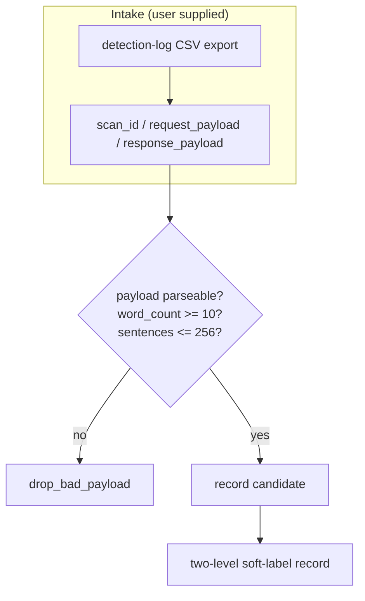
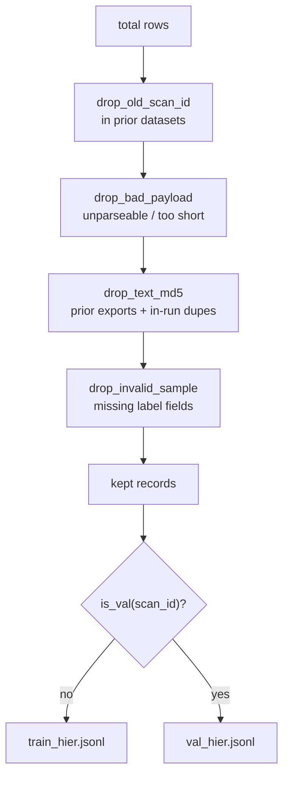
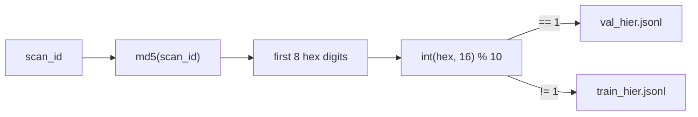
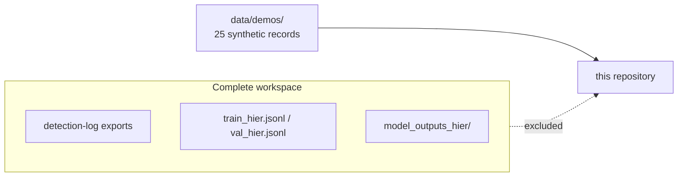

# Data construction

[Chinese](DATA_CONSTRUCTION.zh-CN.md)

Stage i (`code/i_prepare_hier_dataset.py`) turns a detection-service log
export into a deduplicated two-level soft-label dataset. This document
specifies the intake contract, the deduplication funnel, the split rule, and
the record schema.

## Intake contract

The input is one CSV export per run, plus optional prior exports for
cross-run deduplication. The expected columns:

| Column | Content |
|---|---|
| `scan_id` | the upstream request id (used as the deterministic split key) |
| `request_payload` | JSON: `{"document": "<the submitted text>"}` |
| `response_payload` | JSON: `{"documents": [<one document>]}` |

From `response_payload.documents[0]` the script reads:

- `predictedClass` — stored as `gptzero_doc_class`,
- `language` — stored as `gptzero_language`,
- `classProbabilities` — the document soft label (`doc_label`),
- `sentences[].classProbabilities` — the sentence soft labels (`y_origin`).

The two `gptzero_*` field names are kept verbatim for schema compatibility;
they label the upstream service's output, not this project's judgment. The
intake is described generically as "labels from the upstream detection-service
log".

## Deduplication funnel

Three exclusion layers prevent leakage between runs and within one run:

1. **Old scan_id exclusion** — scan_ids already present in prior datasets
   (`--old-scan-jsonls`) are dropped.
2. **Old text exclusion** — texts whose whitespace-normalized MD5 appears in
   prior exports (`--old-csvs`) are dropped.
3. **In-run deduplication** — the MD5 set is extended with every kept record,
   so duplicate texts within the new export are dropped too.

On a fresh clone the two prior-run layers are empty by default; pass
`OLD_CSVS` / `OLD_SCAN_JSONLS` on repeat runs to re-arm them.

## Split rule

The train/validation split is a hash of the upstream request id:

`md5(scan_id)[:8] % 10 == 1 → val` holds in every run, so reruns are
reproducible and the split cannot drift between documents. The same rule is
asserted by `make demo-validate` against the synthetic demo files.

## Record schema

One JSON object per line, written with `ensure_ascii=False`:

| Field | Type | Meaning |
|---|---|---|
| `scan_id` | 32-hex string | upstream request id; also the split key |
| `text` | string | the full submitted document |
| `doc_label` | float[3] | document soft label `[human, ai, mixed]`, sums to 1 |
| `sentences` | array | one entry per sentence |
| `sentences[].text` | string | the sentence (a substring of `text`) |
| `sentences[].y_origin` | float[3] | sentence soft label `[human, ai, paraphrased]` |
| `sentences[].y_human_ai` | float | `y_origin[0]`, the human probability |
| `gptzero_doc_class` | string | upstream document class label |
| `gptzero_language` | string | upstream language code |

The demo records under `data/demos/01_prepare/` additionally carry
`"source": "synthetic"`, which is the machine-checkable provenance gate: the
production intake never writes a `source` field, so real user text can never
pass `make demo-validate`.

## Soft labels

Both levels are trained against probability distributions rather than
one-hot classes. Sentence labels use the upstream sentence probabilities
directly; document labels use the upstream document probabilities. Weighted
soft cross-entropy with class weights `1,1,2` counters the minority classes
(`mixed`, `paraphrased`).

## Release boundary

What is published: the intake/derivation code, the schemas, and 25 synthetic
demo records with pinned hashes. What is never published: log exports (they
contain user-supplied text and may contain PII), the derived JSONL files, and
model checkpoints. Even the demo records must be reviewed by a human before
any redistribution under your own name; the automated gate bounds volume and
integrity, it does not replace judgment.
