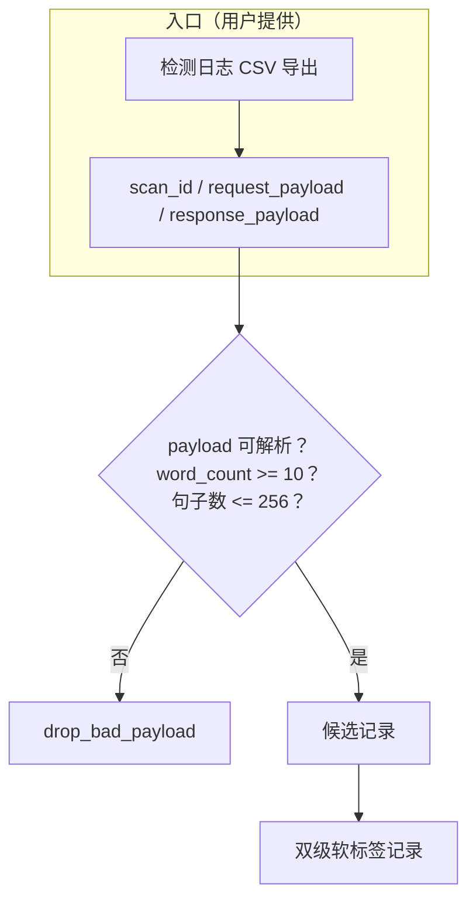
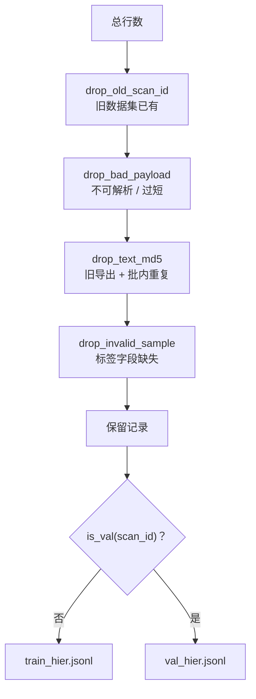
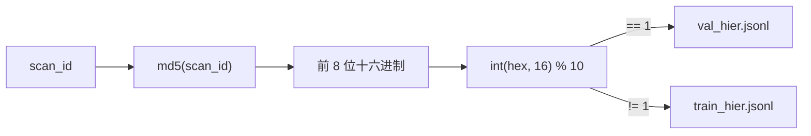
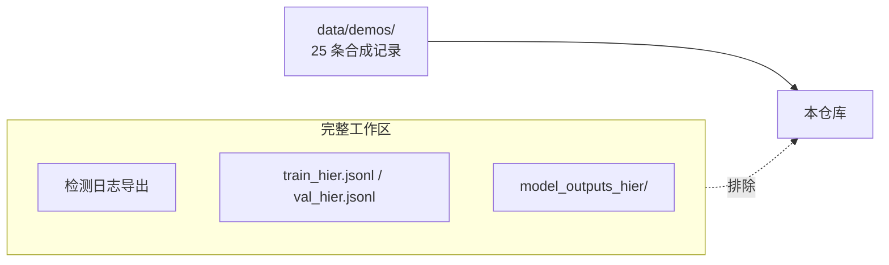

# 数据构造方法

[英文版](DATA_CONSTRUCTION.md)

阶段 i（`code/i_prepare_hier_dataset.py`）把检测服务日志导出加工成去重后的
双级软标签数据集。本文规定入口契约、去重漏斗、划分规则与记录 schema。

## 入口契约

每次运行输入一份 CSV 导出，可选附上前几批导出用于跨批去重。期望列：

| 列 | 内容 |
|---|---|
| `scan_id` | 上游请求 id（用作确定性划分键） |
| `request_payload` | JSON：`{"document": "<提交的文本>"}` |
| `response_payload` | JSON：`{"documents": [<一篇文档>]}` |

脚本从 `response_payload.documents[0]` 读取：

- `predictedClass`——存为 `gptzero_doc_class`；
- `language`——存为 `gptzero_language`；
- `classProbabilities`——文档级软标签（`doc_label`）；
- `sentences[].classProbabilities`——句子级软标签（`y_origin`）。

两个 `gptzero_*` 字段名为 schema 兼容原样保留；它们记录的是上游服务输出，
不代表本项目的判断。文档中对入口统一以「上游检测服务日志标签」中性描述。

## 去重漏斗

三重排除在批次之间与批次内部防泄露：

1. **旧 scan_id 排除**——已出现在旧数据集（`--old-scan-jsonls`）中的
   scan_id 全部剔除；
2. **旧文本排除**——空白归一化后 MD5 命中旧导出（`--old-csvs`）的文本剔除；
3. **批内去重**——MD5 集合随保留记录持续扩充，新导出内部的重复文本同样剔除。

全新 clone 上前两层默认为空；重复运行时传 `OLD_CSVS` / `OLD_SCAN_JSONLS`
重新武装。

## 划分规则

训练/验证划分以上游请求 id 的哈希为准：

`md5(scan_id)[:8] % 10 == 1 → val` 每次运行恒定，重跑可复现，且划分不会在
文档间漂移。`make demo-validate` 会对合成 demo 文件断言同一规则。

## 记录 schema

每行一个 JSON 对象，`ensure_ascii=False` 写出：

| 字段 | 类型 | 含义 |
|---|---|---|
| `scan_id` | 32 位 hex 字符串 | 上游请求 id；同时是划分键 |
| `text` | string | 提交的完整文档 |
| `doc_label` | float[3] | 文档级软标签 `[human, ai, mixed]`，和为 1 |
| `sentences` | array | 每句一条 |
| `sentences[].text` | string | 句子文本（是 `text` 的子串） |
| `sentences[].y_origin` | float[3] | 句子级软标签 `[human, ai, paraphrased]` |
| `sentences[].y_human_ai` | float | `y_origin[0]`，即人类概率 |
| `gptzero_doc_class` | string | 上游文档类标签 |
| `gptzero_language` | string | 上游语言码 |

`data/demos/01_prepare/` 下的 demo 记录额外带 `"source": "synthetic"`，
这是机器可校验的溯源门禁：生产入口从不写 `source` 字段，因此真实用户文本
永远过不了 `make demo-validate`。

## 软标签

两级均以概率分布而非 one-hot 类别为训练目标。句子标签直接用上游句级概率，
文档标签用上游文档级概率。带类权重 `1,1,2` 的加权软交叉熵对抗少数类
（`mixed`、`paraphrased`）坍塌。

## 发布边界

对外发布：入口与派生代码、schema 文档、25 条哈希锁定的合成 demo 记录。
永不发布：日志导出（含用户提交文本、可能含 PII）、派生 JSONL、模型权重。
即使 demo 记录也需人工复核后才能以你自己的名义再分发；自动门禁约束的是
数量与完整性，替代不了判断。
