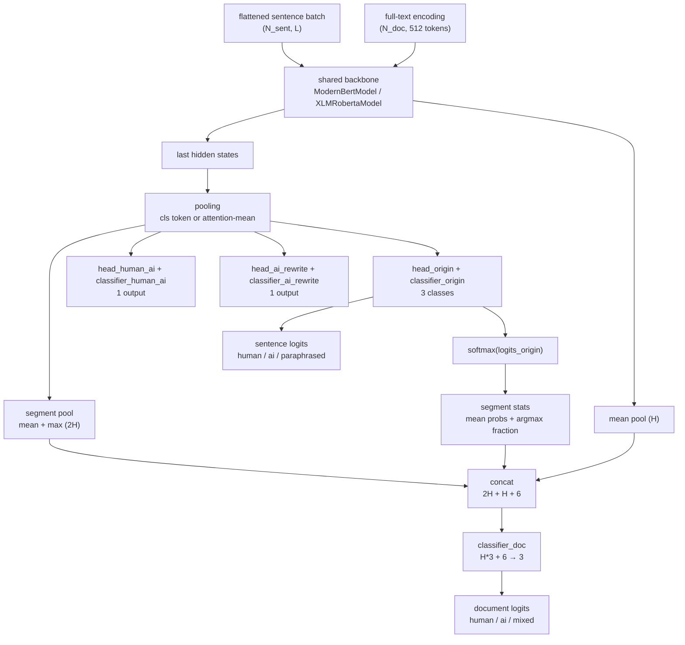
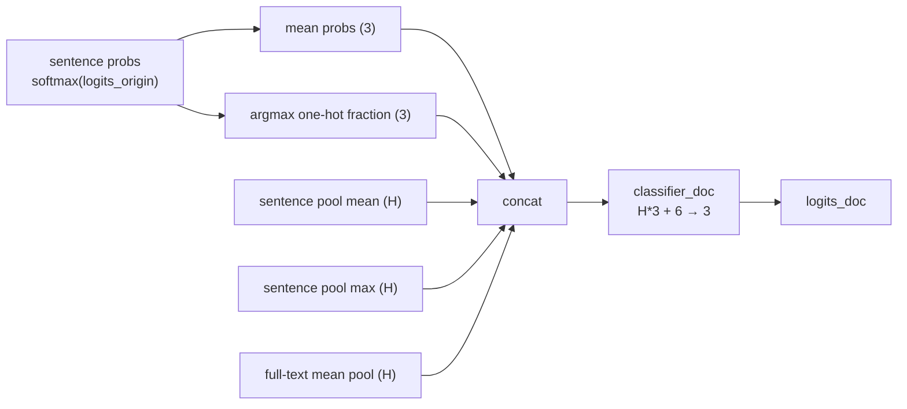
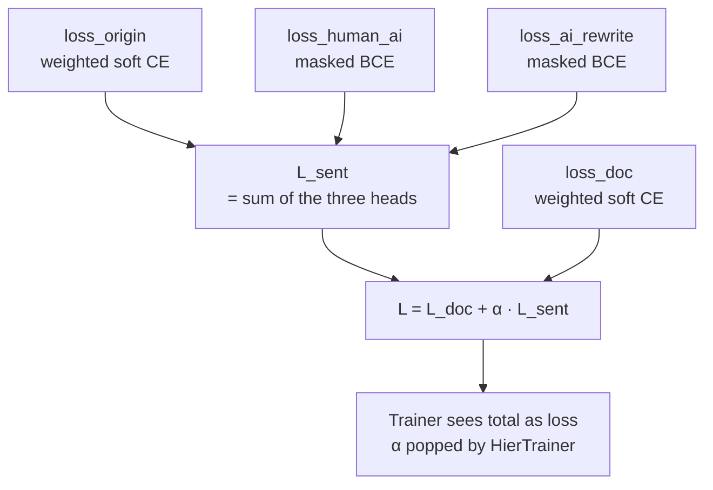
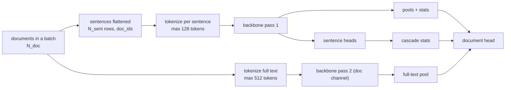

# Model structure

[Chinese](MODEL.zh-CN.md)

This document describes the joint two-level detection model in isolation:
head layout, pooling, losses, the document-head feature vector, the output
contract, and the two interchangeable backbones. For how the model fits into
the pipeline, see [ARCHITECTURE.md](ARCHITECTURE.md); for the labels it is
trained against, see [DATA_CONSTRUCTION.md](DATA_CONSTRUCTION.md).

The model is implemented in `model_entity/hier_aidetect_model.py`
(ModernBERT backbone) and `model_entity/hier_xlmr_model.py` (XLM-R backbone),
with `model_entity/hier_model_factory.py` routing between them.

## Overview

One forward pass through the backbone serves every head. Sentence labels are
predicted by three heads on the per-sentence hidden states; document labels
are predicted by one head over a concatenation of pooled sentence features, a
full-text encoding, and differentiable sentence-probability statistics.

## Pooling

Sentence vectors are pooled from the last hidden states with the
attention mask:

- ModernBERT entity: honors `config.classifier_pooling` — `"cls"` takes the
  CLS token, anything else (the default) uses attention-masked mean pooling.
- XLM-R entity: always attention-masked mean pooling; no CLS pooler, so the
  distilled semantics stay aligned with the ModernBERT entity.

## Sentence-level heads

| Head | Projection | Shape | Loss | Target |
|---|---|---|---|---|
| `head_origin` + `classifier_origin` | prediction head + linear | H → 3 | weighted soft cross-entropy | sentence soft label `[human, ai, paraphrased]` |
| `head_human_ai` + `classifier_human_ai` | prediction head + linear | H → 1 | masked BCE | human probability (`y_human_ai`) |
| `head_ai_rewrite` + `classifier_ai_rewrite` | prediction head + linear | H → 1 | masked BCE | AI-rewrite probability |

Notes:

- The ModernBERT entity uses `ModernBertPredictionHead` before each linear
  projection; the XLM-R entity uses plain `nn.Linear` projections directly on
  the pooled states. The naming of the three head pairs matches the
  single-level baseline entity so `from_pretrained` warm starts work.
- `classifier_dropout` (0.1 by default from the training config) is applied
  to the pooled states before every classifier.
- The masked BCE uses the sentinel `LABEL_IGNORE = -1.0`: positions carrying
  it are zeroed before the loss and excluded by the mask, so a batch with no
  valid positions yields `None` instead of NaN.
- Class weights are applied with a **sample-level** weight
  `sw = sum_i(t_i · w_i)` — the inner product of the label distribution and
  the class weights — then `sum(sw · CE) / sum(sw)`. Per-dimension
  reweighting is deliberately avoided: on near-one-hot labels the numerator
  and denominator would cancel and the weights would have no effect.

## Document head

The document head input is the concatenation of three channels:

| Channel | Shape | Content |
|---|---|---|
| segment pool | 2H | mean and max pooling of sentence vectors grouped by document (`index_add_` sums, `scatter_reduce_` amax) |
| full-text | H | a second backbone pass over the whole document (512 tokens), mean-pooled |
| segment stats | 2C = 6 | per-document mean of sentence probabilities and argmax fraction per class, both differentiable |

The segment statistics give the document head an explicit "how many sentences
look AI-written" signal, which is what makes the `mixed` class trainable:
gradients flow from `classifier_doc` back through the statistics into the
sentence heads.

With `xlm-roberta-large` (H = 1024) the document head input is
`1024*3 + 6 = 3078 → 3`; with `ModernBERT-base` (H = 768) it is
`2310 → 3`. If the full-text channel is absent (serving a batch without
full-text encodings is not supported — training always supplies it), the
channel degrades to zero padding.

## Loss composition

`α` defaults to 1.0. Document class weights default to `1,1,2` and sentence
class weights to `1,1,2`, countering minority-class collapse (`mixed`,
`paraphrased`). Every per-head loss is also returned separately for logging.

## Output contract

`HierAiDetectOutput` (a `ModelOutput` dataclass) carries:

| Field | Shape | Meaning |
|---|---|---|
| `loss` | scalar | the total loss, or `None` when no labels are supplied |
| `logits_origin` | (N_sent, 3) | sentence logits `[human, ai, paraphrased]` |
| `logits_human_ai` | (N_sent, 1) | auxiliary sentence logits |
| `logits_ai_rewrite` | (N_sent, 1) | auxiliary sentence logits |
| `logits_doc` | (N_doc, 3) | document logits `[human, ai, mixed]`, `None` when `doc_ids` is absent |
| `loss_origin` / `loss_human_ai` / `loss_ai_rewrite` / `loss_doc` | scalar | per-head losses for logging |
| `pooled` | (N_sent, H) | pooled sentence vectors |

Inference only consumes `logits_origin` and `logits_doc`; the serving layer
softens `logits_doc` with the calibration temperature before building the
response (see [API.md](API.md)).

## Two backbones, two entities

| | ModernBERT entity | XLM-R entity |
|---|---|---|
| File | `model_entity/hier_aidetect_model.py` | `model_entity/hier_xlmr_model.py` |
| Base class | `ModernBertPreTrainedModel` | `XLMRobertaPreTrainedModel` |
| Backbone attribute | `self.model` | `self.roberta` |
| Sentence heads | `ModernBertPredictionHead` + linear | plain `nn.Linear` |
| Pooling | `cls` or attention-mean | attention-mean |
| Default cold start | `answerdotai/ModernBERT-base` | `FacebookAI/xlm-roberta-large` |

The two entities are deliberately duplicated rather than unified behind an
abstract base class: they derive from different `PreTrainedModel` bases, and
each keeps its own loss/pooling methods so the pair can evolve independently.
Shared constants and the output dataclass are imported from the ModernBERT
entity. `hier_model_factory.load_hier_model_class(model_type)` resolves a
model class at runtime (the XLM-R entity is imported lazily so that importing
the factory does not force both backbones).

The XLM-R entity's backbone attribute **must** be named `self.roberta`:
official XLM-R checkpoint keys are prefixed `roberta.*`, and a different
attribute name would make `from_pretrained` silently skip the entire
backbone.

## Checkpoint contract

Weights are loaded non-strictly: keys missing from a checkpoint (new
classification heads) are randomly initialized, and unexpected keys are
reported. The serving startup guard then rejects any missing key that is not
a `classifier_*` or `head_*` — a mismatch between `AI_DETECT_MODEL_TYPE` and
the checkpoint directory fails fast instead of silently serving random
backbone weights. The training script prints the same missing/unexpected key
summary after loading.

## Batch structure

The collator (`make_hier_collate_fn` in `code/j_train_hier_model.py`) builds
exactly this structure: flattened sentence tensors with `doc_ids`, per-document
full-text tensors, and all five label tensors plus `alpha`. The serving
batcher builds the same tensor layout, so training and inference share one
forward path.

## What the model is not

- No per-paragraph heads: paragraph probabilities are means of sentence
  probabilities (see [API.md](API.md) section 5.3).
- No perplexity or burstiness estimation: those response fields are reserved
  and always 0.
- No authorship proof: outputs are probability estimates over distilled soft
  labels, intended for triage, not verdicts.
