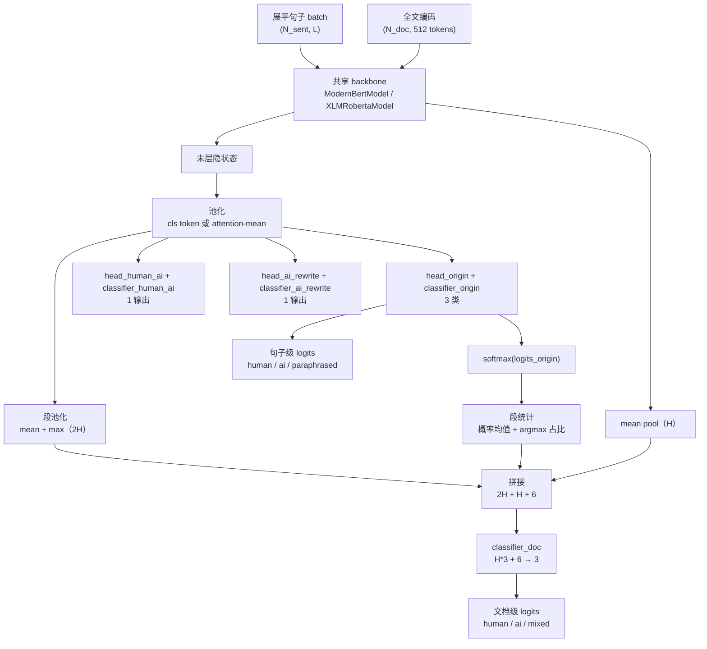
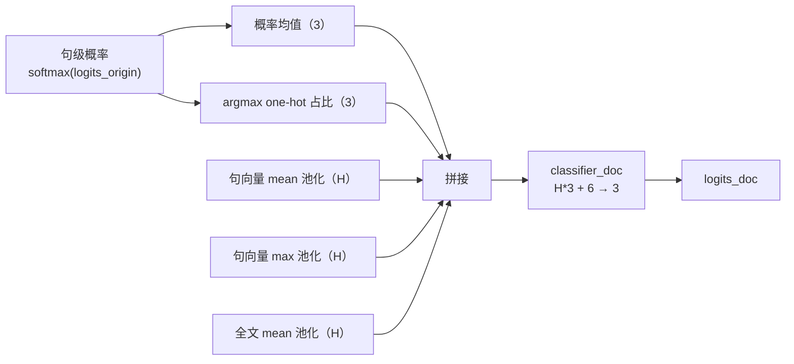
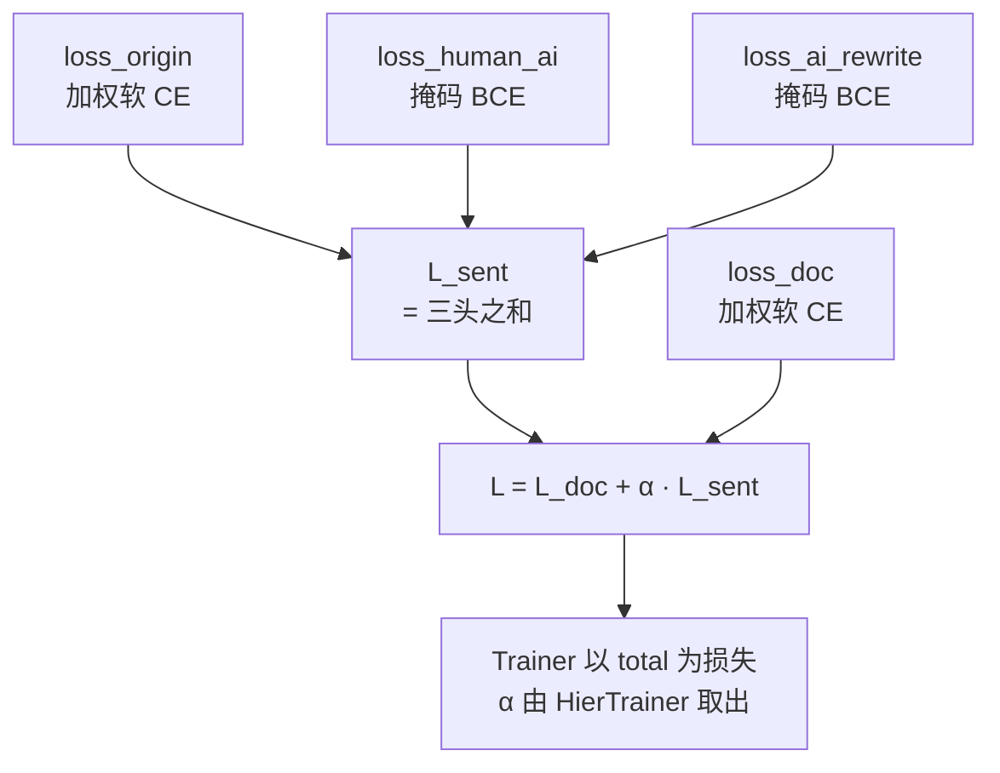
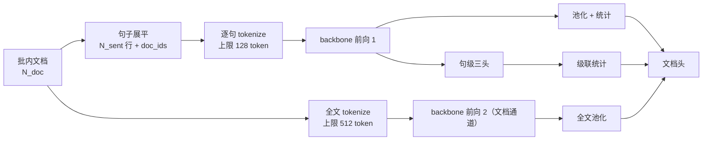

# 模型结构

[英文版](MODEL.md)

本文单独介绍联合双级检测模型本身：头部布局、池化、损失、文档头特征向量、
输出契约与两种可互换的 backbone。模型在流水线中的位置见
[ARCHITECTURE.zh-CN.md](ARCHITECTURE.zh-CN.md)；训练所用的标签见
[DATA_CONSTRUCTION.zh-CN.md](DATA_CONSTRUCTION.zh-CN.md)。

实现位于 `model_entity/hier_aidetect_model.py`（ModernBERT backbone）与
`model_entity/hier_xlmr_model.py`（XLM-R backbone），由
`model_entity/hier_model_factory.py` 做运行时路由。

## 总览

backbone 一次前向服务所有头：句子标签由三个头在句级隐状态上预测；文档标签
由一个头在「句特征池化 + 全文编码 + 可微句概率统计」的拼接向量上预测。

## 池化

句向量由末层隐状态按 attention mask 池化得到：

- ModernBERT 实体：遵循 `config.classifier_pooling`——`"cls"` 取 CLS token，
  其余取值（默认）用 attention-masked mean pooling。
- XLM-R 实体：恒用 attention-masked mean pooling，不用 CLS pooler，保证与
  ModernBERT 实体的蒸馏语义对齐。

## 句级三头

| 头 | 投影 | 形状 | 损失 | 目标 |
|---|---|---|---|---|
| `head_origin` + `classifier_origin` | 预测头 + 线性 | H → 3 | 加权软交叉熵 | 句级软标签 `[human, ai, paraphrased]` |
| `head_human_ai` + `classifier_human_ai` | 预测头 + 线性 | H → 1 | 掩码 BCE | 人类概率（`y_human_ai`） |
| `head_ai_rewrite` + `classifier_ai_rewrite` | 预测头 + 线性 | H → 1 | 掩码 BCE | AI 改写概率 |

要点：

- ModernBERT 实体在每个线性投影前用 `ModernBertPredictionHead`；XLM-R 实体
  直接在池化向量上用裸 `nn.Linear`。三对头部的命名与单级基线实体一致，
  保证 `from_pretrained` 热启动兼容。
- `classifier_dropout`（训练配置默认 0.1）在每个分类器前作用于池化向量。
- 掩码 BCE 使用哨兵值 `LABEL_IGNORE = -1.0`：该位置的标签先置零再进损失、
  由掩码排除，整批无有效位置时返回 `None` 而非 NaN。
- 类权重以**样本级**权重生效：`sw = sum_i(t_i · w_i)`（标签分布与权重向量
  的内积），再按 `sum(sw · CE) / sum(sw)` 加权。刻意不做按维重加权——在近
  one-hot 标签上分子分母会约掉，权重将失效。

## 文档头

文档头输入为三个通道的拼接：

| 通道 | 形状 | 内容 |
|---|---|---|
| 段池化 | 2H | 句向量按文档分组做 mean 与 max 池化（`index_add_` 求和、`scatter_reduce_` amax） |
| 全文编码 | H | backbone 对整篇文档（512 token）的第二次前向，mean 池化 |
| 段统计 | 2C = 6 | 句级概率的文档内均值与各类 argmax 占比，均可微 |

段统计为文档头提供「有多少句子像 AI 写的」显式信号，这正是 `mixed` 类可
训练的关键：梯度从 `classifier_doc` 经统计量回传到句级头。

以 `xlm-roberta-large`（H = 1024）为例，文档头输入为
`1024*3 + 6 = 3078 → 3`；`ModernBERT-base`（H = 768）则为 `2310 → 3`。
若全文通道缺失（训练总是提供），该通道退化为零填充。

## 损失合成

`α` 默认 1.0。文档类权重默认 `1,1,2`，句子类权重默认 `1,1,2`，对抗少数类
（`mixed`、`paraphrased`）坍塌。各头损失单独返回，仅用于日志。

## 输出契约

`HierAiDetectOutput`（`ModelOutput` 数据类）携带：

| 字段 | 形状 | 含义 |
|---|---|---|
| `loss` | 标量 | 总损失；无任何标签时为 `None` |
| `logits_origin` | (N_sent, 3) | 句级 logits `[human, ai, paraphrased]` |
| `logits_human_ai` | (N_sent, 1) | 辅助句级 logits |
| `logits_ai_rewrite` | (N_sent, 1) | 辅助句级 logits |
| `logits_doc` | (N_doc, 3) | 文档级 logits `[human, ai, mixed]`；无 `doc_ids` 时为 `None` |
| `loss_origin` / `loss_human_ai` / `loss_ai_rewrite` / `loss_doc` | 标量 | 分头损失，仅日志用 |
| `pooled` | (N_sent, H) | 池化句向量 |

推理只消费 `logits_origin` 与 `logits_doc`；服务层在组装响应前用校准温度
软化 `logits_doc`（见 [API.zh-CN.md](API.zh-CN.md)）。

## 两种 backbone、两个实体

| | ModernBERT 实体 | XLM-R 实体 |
|---|---|---|
| 文件 | `model_entity/hier_aidetect_model.py` | `model_entity/hier_xlmr_model.py` |
| 基类 | `ModernBertPreTrainedModel` | `XLMRobertaPreTrainedModel` |
| backbone 属性 | `self.model` | `self.roberta` |
| 句级头 | `ModernBertPredictionHead` + 线性 | 裸 `nn.Linear` |
| 池化 | `cls` 或 attention-mean | attention-mean |
| 默认冷启动 | `answerdotai/ModernBERT-base` | `FacebookAI/xlm-roberta-large` |

两个实体刻意复制而非抽象公共基类：它们的 `PreTrainedModel` 基类不同，各自
保留独立的损失/池化方法，可分别演化。共享常量与输出数据类从 ModernBERT
实体导入。`hier_model_factory.load_hier_model_class(model_type)` 在运行时
解析模型类（XLM-R 实体懒加载，import 工厂不会强制拉起两个 backbone）。

XLM-R 实体的 backbone 属性**必须**叫 `self.roberta`：官方 XLM-R checkpoint
键前缀为 `roberta.*`，属性名不符会让 `from_pretrained` 静默跳过整个
backbone。

## 权重加载契约

权重以非严格方式加载：checkpoint 中缺失的键（新分类头）随机初始化，多余
的键给出报告。服务启动守卫随后拒绝任何非 `classifier_*` / `head_*` 的缺失
键——`AI_DETECT_MODEL_TYPE` 与 checkpoint 目录不匹配时快速失败，而不是静默
用随机 backbone 权重对外服务。训练脚本在加载后打印同样的缺失/多余键摘要。

## 批结构

collator（`code/j_train_hier_model.py` 的 `make_hier_collate_fn`）构建的正是
该结构：展平的句子张量带 `doc_ids`、每文档的全文张量、五组标签张量外加
`alpha`。服务端攒批器构建同样的张量布局，训练与推理共享同一条前向路径。

## 模型边界

- 无段落级分类头：段落概率是句级概率的均值（见
  [API.zh-CN.md](API.zh-CN.md) 5.3 节）。
- 无困惑度/突发性估计：响应中的保留字段恒为 0。
- 输出不是作者身份证明：它是蒸馏软标签上的概率估计，用于分诊而非定论。
